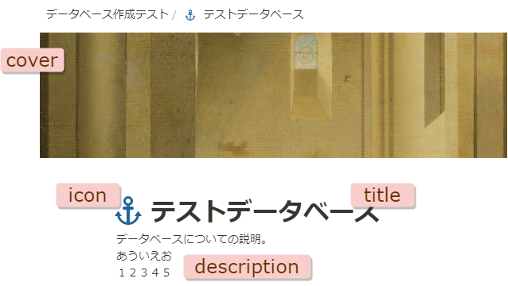

# gas-notion-update-header

Notion のデータベースまたはページのヘッダーに関連する項目を簡易的に更新する Googl Apps Script Library。



## Setup

### App Script

ライブラリーは App Script で利用できる状態になっています。
Apps Script のコードエディターで以下の手順を実行するとプロジェクトへ追加できます。

1. コードエディターのファイル名一覧が表示される部分の「ライブラリ +」をクリック
1. 「スクリプト ID」フィールドに `1aNOkTIUB6u8WQmBydsnFh6Yjh5FsZ1U1b-1cre8Oo5b0hEgwyDquolYv` を入力し検索をクリック
1. バージョンを選択(通常は最新版)
1. 「ID」を `UpdateHeader` 等へ変更
1. 「追加」をクリック

上記以外にも Release ページから `gas-notion-update-header` をダウンロードし、`/dist` ディレクトリーをプロジェクトへコピーできます。

### Notion

Notion 外部からデータベースを操作するためのインテグレーション(API KEY)が必要です。以下を参考に作成してください。機能(権限)は最小で「コンテンツを更新」が必要です。

- [Step 1: Create an integration](https://developers.notion.com/docs/create-a-notion-integration#step-1-create-an-integration)

以下を参考に、更新予定のデータベースまたはページをインテグレーションと共有してください。

- [Step 2: Share a database with your integration](https://developers.notion.com/docs/create-a-notion-integration#step-2-share-a-database-with-your-integration)

## Usage

Notion Database を更新するサンプルコードです。

### dataqbase

```js
const props = PropertiesService.getScriptProperties()
UpdateHeader.update({
  apiKey: props.getProperty('notion_api_key'),
  id: '<youre dataase id>',
  kind: 'database',
  icon: '⚓',
  description: 'データベースについての説明。\nあういえお\n１２３４５',
  title: 'テストデータベース',
  cover: '<youre cover image url>'
})
```

**Note:** `title` と `description` には [rich text object](https://developers.notion.com/reference/rich-text) 配列も指定できます。

### page

```js
const props = PropertiesService.getScriptProperties()
UpdateHeader.update({
  apiKey: props.getProperty('notion_api_key'),
  id: '<youre page id>',
  kind: 'page',
  icon: '⚓',
  title: 'テストページ',
  cover: '<youre cover image url>'
})
```

**Note:** page に `description` は存在しないので指定しても無視されます。

**Note:** `title` のプロパティは名デフォルトで `title` を指定しています。変更する場合は `{title: '<youre title>, name: <prperty name>}` のように指定できます。

## TypeScript

TypeScript(clasp) でコードを記述している場合は、以下の方法で型定義を設定できます。

型定義パッケージをインストールします。

```console
$ npm install --save-dev  @hankei6km/gas-notion-update-header
```

`tsconfig.json` に定義を追加します。

```json
{
  "compilerOptions": {
    "target": "ES2019",
    "module": "ES2020",
    "lib": ["ESNext"],
    "types": [
      "@types/google-apps-script",
      "@hankei6km/gas-notion-update-header"
    ]
  }
}
```

## License

MIT License

Copyright (c) 2023 hankei6km
